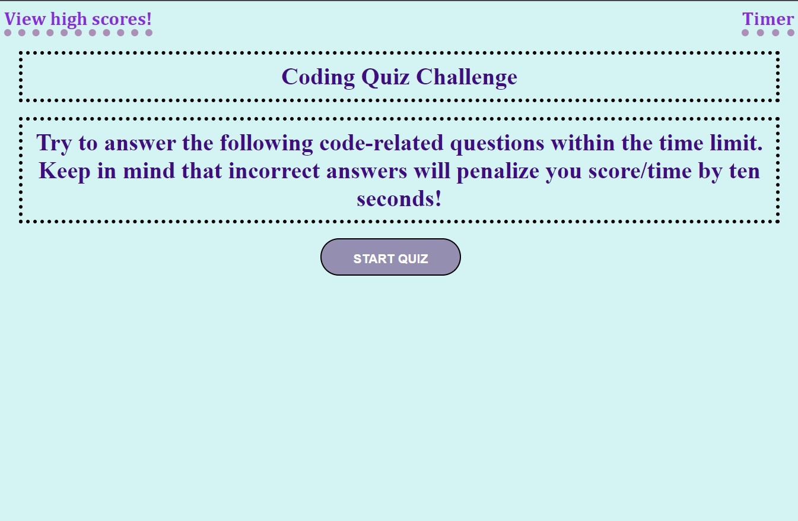

Quiz-em

I built this project with what i learned at the time during class and want to say this was the hardest challenge by far.  Pushing myself to be exposed to more JS codes help me understand more of how more complex functions worked such as for loops, whiles, and elses.  Styling through JS was cool to learn aswell leaving many options open and alot of information to take in.

Usage
n/a
https://xkranze.github.io/quiz-em/

Credits:
Tutor
Youtube
stackoverflow
https://www.w3schools.com/
